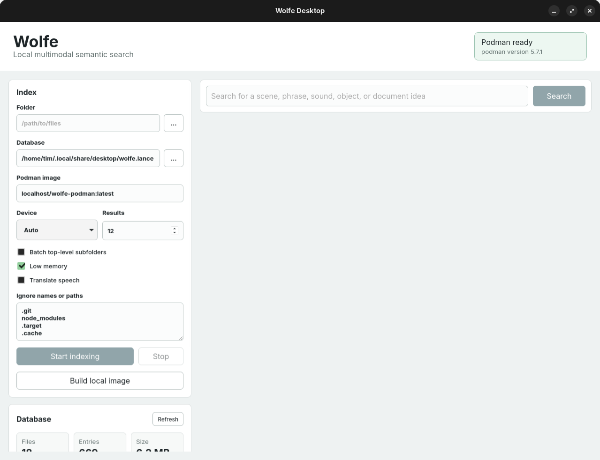

# Wolfe Desktop

Wolfe Desktop is a Tauri desktop client for local multimodal semantic search. It provides a Svelte UI for indexing folders, searching a Lance database, previewing matching media, and opening source files from the results.

The app delegates indexing and search work to a Podman image, so the desktop shell stays small while the Wolfe runtime remains portable.



## Features

- Index local folders into a Lance database.
- Search indexed content by natural language query.
- Preview images, audio, video, documents, and generic files in search results.
- Track indexing progress by batch and file count.
- Batch indexing by top-level subfolder for large collections.
- Configure device mode: auto, CPU, CUDA, or MPS.
- Toggle low-memory mode and speech translation.
- Manage ignore patterns and delete the current database from the UI.
- Build the default Wolfe Podman image from `https://github.com/timschmidt/wolfe-podman.git`.

## Tech Stack

- Tauri 2
- Svelte 5
- Vite 6
- TypeScript
- Rust
- Podman
- Lance

## Prerequisites

Install the following before running the app:

- Node.js and npm
- Rust and Cargo
- Podman
- Tauri Linux system dependencies

On Fedora, the Tauri dependencies are typically:

```bash
sudo dnf install webkit2gtk4.1-devel openssl-devel curl wget file libappindicator-gtk3-devel librsvg2-devel patchelf
```

Podman must be available on `PATH`:

```bash
podman --version
```

For NVIDIA GPU acceleration, install the NVIDIA Container Toolkit and generate a Podman CDI specification:

```bash
sudo nvidia-ctk cdi generate --output=/etc/cdi/nvidia.yaml
podman run --rm --device nvidia.com/gpu=all ubuntu:24.04 nvidia-smi
```

Wolfe Desktop automatically passes the CDI device to Podman when **Device** is `Auto` or `CUDA` and `/etc/cdi/nvidia.yaml` or `/var/run/cdi/nvidia.yaml` exists. Override the CDI device name with `WOLFE_CDI_DEVICE` if your host uses a different name.

Model caches are stored in the Podman volume `wolfe-cache`, mounted at `/cache` inside the container. Override the volume name with `WOLFE_CACHE_VOLUME` if you want separate model caches for different datasets or test runs.

## Setup

Install JavaScript dependencies:

```bash
npm install
```

Start the desktop app in development mode:

```bash
npm run tauri dev
```

Run the web frontend only:

```bash
npm run dev
```

Build the frontend:

```bash
npm run build
```

Build the Tauri app:

```bash
npm run tauri build
```

## Podman Image

The default image name is:

```text
localhost/wolfe-podman:latest
```

The app can build this image from the UI with **Build local image**. The equivalent command is:

```bash
podman build -t localhost/wolfe-podman:latest https://github.com/timschmidt/wolfe-podman.git
```

You can also enter another image name in the app if you maintain a custom Wolfe image.

## Using The App

1. Choose a folder to index.
2. Choose or accept the Lance database path.
3. Confirm the Podman image name.
4. Select indexing options:
   - **Batch top-level subfolders** splits the job into one batch per child directory.
   - **Low memory** passes `--low-memory` to the Wolfe runtime.
   - **Translate speech** passes `--translate`.
   - **Device** passes `--device auto|cpu|cuda|mps` to Wolfe. `Auto` and `CUDA` also enable NVIDIA CDI passthrough for Podman when a CDI spec is present.
5. Click **Start indexing**.
6. Enter a query and click **Search**.
7. Click a result path or document preview to open it with the system default app.

## Database Location

By default, Wolfe Desktop stores its database under the platform data directory for `com.wolfe.desktop`, with a table path ending in `wolfe.lance`.

You can choose a different database parent directory in the UI. If the selected path ends in `.lance`, it is treated as the table path. Otherwise, the app looks for `embeddings.lance` inside that directory.

The database panel shows:

- Unique file count
- Entry count
- Database size
- Resolved table path

## Development Notes

The main frontend entry point is:

```text
src/App.svelte
```

The Tauri command implementation is:

```text
src-tauri/src/lib.rs
```

Tauri configuration lives in:

```text
src-tauri/tauri.conf.json
```

The dev server is configured to run on:

```text
http://127.0.0.1:1420
```

## Releases

Release builds are produced by GitHub Actions from version tags. The release workflow builds Linux `.deb`, `.rpm`, and `.AppImage` artifacts, uploads them to the workflow run, and attaches them to a GitHub Release when the workflow was started by a tag.

To publish a release:

```bash
git tag v0.1.0
git push origin v0.1.0
```

You can also run the release workflow manually from the GitHub Actions tab. Manual runs upload the build artifacts to the workflow run but do not publish a GitHub Release.

## Troubleshooting

### Tauri reads permissions from another repo

If `npm run tauri dev` fails with a path like another project under `src-tauri/target/debug/build/.../permissions`, the Cargo target directory contains stale generated build artifacts. Clean and rebuild:

```bash
cd src-tauri
cargo clean
cd ..
npm run tauri dev
```

### Podman is missing

If the app says Podman is missing, verify that `podman --version` works in the same shell used to start Tauri.

### Image not found

Build the default image from the UI or run:

```bash
podman build -t localhost/wolfe-podman:latest https://github.com/timschmidt/wolfe-podman.git
```

### Search returns no results

Check that the database path in the UI matches the path used during indexing, then refresh the database panel to confirm the table exists and has entries.
